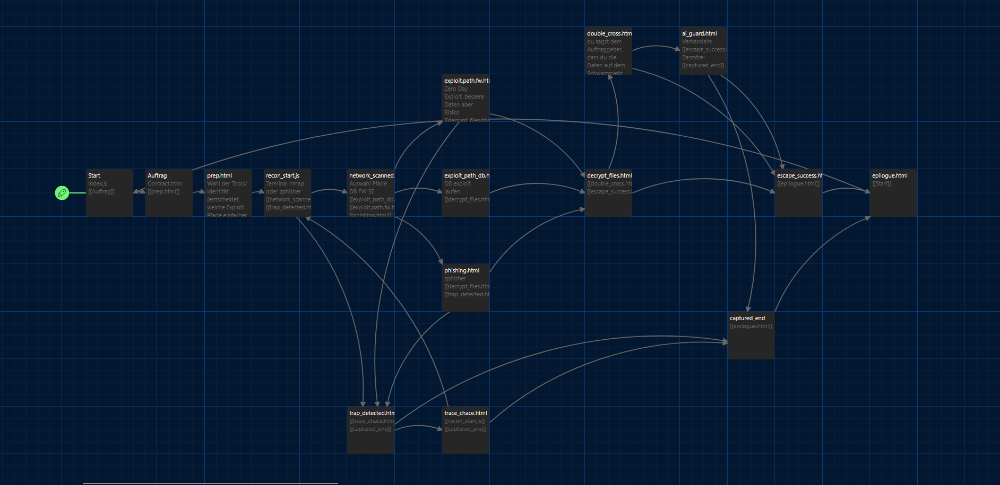

Perfekt — du hast bereits ein Terminal, also baue ich die **Story so**, dass sie mit **15–20 separaten HTML-Seiten** gut spielbar ist. Jede Seite ist ein „Knoten“ der Erzählung (Text + Entscheidungen/Links). Ich gebe dir:

* eine **konkrete Seitenliste** (Dateinamen & kurze Beschreibung),
* **Welche Links** von welcher Seite wohin führen (also ein fertiges Verzweigungsnetz),
* **Wo du APIs** (z. B. OpenAI) einbindest und mit welchen Prompt-Beispielen,
* **Variablen / Status**, die du im Hintergrund tracken solltest (z. B. `traceLevel`, `hasCredentials`),
* **Drei bis vier Enden** und wie man sie erreicht,
* optional: **kleine Text-Snippets** / Einstiegstexte, die du direkt in die Seiten kopieren kannst.

Ich strecke das auf 18 Seiten aus (passt gut in deine Vorgabe). Du kannst leicht auf 15 oder bis 20 erweitern, falls du noch Nebenpfade oder Easter Eggs einbaust.

# 🔗 Seitenübersicht (Dateinamen + kurze Funktion) — 18 Seiten

1. `index.html` — Intro / Auftrag (Einstieg)
2. `contract.html` — Auftrag annehmen / Details prüfen
3. `prep.html` — Vorbereitung: Tools & Identitäten wählen
4. `recon_start.html` — Start des Recon (Eintritt ins Terminal-Interface)
5. `scan_network.html` — Netzwerkscan (Ergebnis: offene Ports / Hinweise)
6. `social_engineer.html` — Social-Engineering-Ansatz (Telefon/Phishing)
7. `exploit_path_db.html` — Exploit: Datenbank-Angriff
8. `exploit_path_fw.html` — Exploit: Firewall/Edge-Angriff
9. `exploit_path_insider.html` — Insider/Employee-Compromise
10. `trap_detected.html` — Falle / Alarm (Sackgasse oder Gegenmaßnahme)
11. `trace_chase.html` — Rückverfolgung beginnt (fliehen vs. sich verstecken)
12. `decrypt_files.html` — Dateien entschlüsseln / Daten extrahieren
13. `double_cross.html` — Auftraggeber-Risiko: Angebot zum Verrat
14. `ai_guard.html` — Die Sicherheits-KI konfrontiert dich (Twist)
15. `escape_success.html` — Erfolg — Daten geliefert & Flucht
16. `betrayal_end.html` — Verratenes Ende (Auftraggeber fängt dich)
17. `captured_end.html` — Gefasst / schlechtes Ende (KI übernimmt)
18. `epilogue.html` — Epilog / Zusammenfassung (zeigt welches Ende erreicht wurde)

# Bild als Visualation


# 🧭 Seitenfluss & Entscheidungen (Kurzmatrix)

Ich beschreibe zu jeder Seite die **entscheidenden Links** (z. B. von `scan_network.html` → `exploit_path_db.html` oder `exploit_path_fw.html`) — so kannst du die HTML-Links direkt setzen.

### 1. `index.html`

* Zweck: Atmosphäre, kurze Einführung, Button: „Auftrag ansehen“ → `contract.html`
* Text-Snippet:

  > Du sitzt im Neonlicht. Ein verschlüsselter Auftrag landet im Feed: hohe Bezahlung, hohes Risiko. Bist du dabei?

### 2. `contract.html`

* Optionen: „Annehmen“ → `prep.html` ; „Ablehnen“ → `epilogue.html` (kurzes neutral-Ende)
* Metadaten: Auftraggeber-Name (z. B. “M. Korva”), Deadline, Zielsystem (Konzern „NovaDyne“), Belohnung.

### 3. `prep.html`

* Wahl der Tools/Identität (entscheidet, welche Exploit-Pfade einfacher sind):

  * `use_phishing` → deutlicher Vorteil bei `social_engineer.html`
  * `use_zero_day` → Bonus für `exploit_path_fw.html`
  * `use_insider_package` → Bonus für `exploit_path_insider.html`
* Links: „Beginne Recon“ → `recon_start.html`

**Hinterlegung:** Setze Status-Flags in `localStorage` oder JS-Objekt: `toolset = {phishing:true, zeroDay:false, insiderKit:false}`

### 4. `recon_start.html`

* Terminal-Intro (du öffnest dein Terminal — hier kannst du deinen existierenden Terminal einbinden)
* Links: `scan_network.html` ; `social_engineer.html` (direkter Sprung, wenn Spieler das will)

### 5. `scan_network.html`

* Zeige aus dem Scan: IPs, offene Ports, Service-Banner (kann von OpenAI oder von Dummy-Daten generiert werden).
* Entscheidung/Links:

  * „Ziele Datenbank“ → `exploit_path_db.html`
  * „Prüfe Firewall/Edge“ → `exploit_path_fw.html`
  * „Schaue nach Mitarbeitenden“ → `exploit_path_insider.html`
* API-Punkt: Du kannst hier OpenAI bitten, realistische Banner/Services zu generieren (siehe Prompts unten).

### 6. `social_engineer.html`

* Du versuchst, einen Mitarbeiter zu phishen oder telefonisch zu überzeugen.
* Links/Ergebnisse:

  * Erfolg → setze `hasCredentials=true` → `exploit_path_db.html` (leichter)
  * Misserfolg → `trap_detected.html`
* API: Verwende OpenAI, um ein natürlich klingendes Gespräch/Email zu erzeugen (z. B. Phishing-Mail-Text, Antwort des Targets).

### 7. `exploit_path_db.html`

* Du greifst die Datenbank an (SQLi / Exploit).
* Szenen: Terminalausgabe, Zugriff auf Dump fragmentarisch (erste Datei-Infos).
* Links:

  * „Weiter extrahieren“ → `decrypt_files.html`
  * „Zurück“ → `scan_network.html` (nur erlauben, wenn du willst)
* Zustand: `dbAccess = true`

### 8. `exploit_path_fw.html`

* Du nutzt Zero-Day / Edge-Exploit, bekommst Zugang zu internen Services.
* Risiko: höhere Trace-Rate, aber größere Entlohnung (besserer Datenzugriff).
* Links:

  * Erfolg → `decrypt_files.html`
  * Fehler → `trap_detected.html`
* Zustand: `fwAccess = true`, erhöhe `traceLevel` bei Fehlschlag

### 9. `exploit_path_insider.html`

* Du nutzt eine kompromittierte Mitarbeiter-Identität (Insider).
* Vorteile: niedrigerer Trace, Zugang zu internen Shares.
* Links:

  * „Nutz Credentials“ → `decrypt_files.html`
  * "Warte auf Antwort" → kleines Time-Delay-Event (kann zum `trap_detected.html` führen)

### 10. `trap_detected.html`

* Alarm wird ausgelöst: IDS meldet ungewöhnliche Aktivitäten.
* Optionen:

  * „Sofort abkoppeln und Spuren verwischen“ → `trace_chase.html` mit Chance auf Erfolg
  * „Weitergehen, schneller extrahieren“ → hohes Risiko → möglich `captured_end.html`
* API: OpenAI kann dramatischen Alarm-Text, Logs oder „Sicherheits-KI“-Meldungen generieren.

### 11. `trace_chase.html`

* Verfolgungssequenz: Du musst Entscheidungen treffen (z. B. „VPN wechseln“ / „Tor exit“ / „Log löschen“).
* Links:

  * Erfolgreich entkommen → `escape_success.html`
  * Scheitern → `double_cross.html` oder `captured_end.html`

### 12. `decrypt_files.html`

* Du hast Daten — musst sie entschlüsseln/filtern. Hier wird die Story relevant (was sind die Daten?).
* Optionen:

  * „Verkauf an Schwarzmarkt“ → `double_cross.html` (Auftraggeber misstraut)
  * „Lieferung an Auftraggeber“ → `double_cross.html` oder `escape_success.html` (je nach Vertrauenslevel)
* API: OpenAI zum Erzeugen plausibler Dateinamen, Sensordaten, interner Memos.

### 13. `double_cross.html`

* Auftraggeber bietet mehr Geld für Exklusivrechte — Versuch des Verrats/Trap.
* Entscheidung:

  * Du nimmst an → Risiko; führt oft zu `betrayal_end.html`
  * Du verweigerst → gehe zu `escape_success.html` oder `ai_guard.html` (wenn TraceLevel hoch)

### 14. `ai_guard.html` (Twist)

* Eine aktive Sicherheits-KI (NovaSentinel) fängt an, mit dir zu „chatten“. Sie stellt Rätsel, droht mit Gegenmaßnahmen, oder manipuliert den Dialog.
* Links/Optionen:

  * „Verhandeln / täuschen“ → führt eventuell zu `escape_success.html` (geschickte KI-Prompts)
  * „Zerstöre/überlade die KI“ → hohes Risiko → `captured_end.html` möglich
* **Wichtig:** Hier kannst du OpenAI direkt in die Rolle dieser KI stecken (system prompt = „Du bist NovaSentinel, eine kalte, präzise Netzwerksicherheits-KI…“)

### 15. `escape_success.html`

* Bestes Ende: Du lieferst Daten, entkommst, Geld landet auf Konto; optional moralischer Epilog.
* Link: `epilogue.html`

### 16. `betrayal_end.html`

* Auftraggeber hat dich verraten: Du wirst lokalisiert, aber nicht vollständig gefasst; bist auf der Flucht.
* Link: `epilogue.html`

### 17. `captured_end.html`

* Schlechtestes Ende: KI übernimmt deine Maschinen / Rechtliche Folgen — Game Over.
* Link: `epilogue.html`

### 18. `epilogue.html`

* Zusammenfassung des Pfades, Anzeige welcher Endzustand erreicht wurde (lesbar durch Status-Flags).
* Optional: Button „Nochmal spielen“ → `index.html`

# 🧠 Status-Variablen (JS / localStorage)

Verwende diese Flags, um Verlauf und Enden zu steuern:

* `traceLevel` (0–100) — steigt bei riskanten Aktionen; bei ≥80 hohe Chance auf `captured_end`.
* `toolset` — Objekt `{phishing, zeroDay, insiderKit}` booleans.
* `hasCredentials` — true/false (aus `social_engineer.html`)
* `dbAccess`, `fwAccess`, `insiderAccess` — true/false
* `dataValue` — Zahl (1–100) des Wertes der extrahierten Daten; beeinflusst Angebot in `double_cross.html`
* `trustWithClient` — Zahl (-50 bis +50) Vertrauen des Auftraggebers; beeinflusst ob er verrät
* `endState` — string, um am Ende das korrekte Epilog-Textstück zu zeigen

Speichere in `localStorage` so kannst du den Fortschritt über Seiten hinweg erhalten:

```js
localStorage.setItem('traceLevel', traceLevel)
```

# 🔌 API-Integrationspunkte & Beispiel-Prompts (OpenAI)

Du hast ein Terminal — großartig. Hier, wo es besonders stimmig ist, solltest du OpenAI-Fetches einbauen (oder Mock-Responses, falls du keine API nutzt).

> **Allgemeiner System-Message (bei Chat completions)**
> `"Du bist ein düsteres Cyberpunk-System-Terminal. Antworte als kurze Systemmeldungen, 1–3 Sätze, manchmal mit Log-Einträgen. Wenn nach einem Phishing-Ergebnis gefragt wird, generiere plausible Mitarbeiterantworten. Wenn nach einer KI-Konfrontation gefragt wird, antworte kalt, analytisch und leicht unheimlich."`

## Beispiele

### A. Scan-Resultate (`scan_network.html`)

Prompt (User):

> „Scan results for 10.14.22.5 — return 4-line service banners and potential exploit hints.“

Antwort-Handling: Terminal zeigt `port 3306 - MySQL 5.7 - vulnerable? CVE-2016-...` (OpenAI erzeugt plausiblen Text).

### B. Phishing-Mail und Antwort (`social_engineer.html`)

Prompt:

> „Generate a short phishing email to 'J. Meyer' to reset their VPN password, and a likely short reply from J. Meyer agreeing and giving temporary code.“

OpenAI liefert `emailText` + `replyText` → show in page; wenn `toolset.phishing` true, Eintrittswahrscheinlichkeit Erfolg erhöhen.

### C. KI-Wache (`ai_guard.html`)

System prompt:

> `"Du bist 'NovaSentinel', die Sicherheits-KI von NovaDyne. Du verteidigst das Netzwerk und versuchst den Angreifer zu überführen. Antworte in 1 bis 2 Sätzen. Wenn der Spieler lügt, erhöhe traceLevel."`

User prompt je nach Spieleraktion (z. B. „Ich bin ein Wartungsbot“) → KI antwortet verdächtig, prüft Credentials etc.

### D. Datei-Entschlüsselung (`decrypt_files.html`)

Prompt:

> „Create 3 plausible file names and 1-line content previews that imply brisante Forschung (financial fraud, biometric data).“

### Hinweis zur Implementierung

* Nutze `fetch()` zu deinem Server-Proxy, der die OpenAI-Keys sicher hält (niemals im Client-code).
* Für die Schulumgebung: wenn kein Server erlaubt, ersetze API-Aufrufe durch lokal gespeicherte JSON-Dumps (Dummy-Responses).

# ✂️ Beispiel-Link-HTML (einfaches Template)

So könnte ein Link in `scan_network.html` aussehen:

```html
<p>Scan complete. Found: <a href="exploit_path_db.html">MySQL server (port 3306)</a> | <a href="exploit_path_fw.html">Edge appliance (port 443)</a></p>
```

# 🎯 Hinweise zu Balance & Spielbarkeit

* **Trace-Level sichtbar?** Zeige einen kleinen „Trace“-Balken oder halte ihn unsichtbar, um Druck aufzubauen. Für die Schule ist sichtbar besser (Lernfaktor).
* **Sackgassen entschärfen:** Wenn Spieler in `trap_detected.html` landen, biete immer 1–2 Rückwege (sonst Frust).
* **Länge:** Jede HTML-Seite sollte 150–400 Wörter enthalten + 2–4 Links. So erreichst du die geforderte Seitenanzahl ohne zu viel Arbeit.
* **Assets:** Ein paar PNG-Icons (Terminal, Alarm, Datei) und ein kurzes Ambient-Loop (mp3) reichen für Atmosphäre.

# ✅ Vier mögliche Enden (Kurz)

1. **Vollständiger Erfolg (`escape_success.html`)**

   * Voraussetzungen: `dbAccess || fwAccess || insiderAccess` true, `traceLevel < 50`, erfolgreiche Entscheidung beim `double_cross`.
2. **Neutral / Auf der Flucht (`betrayal_end.html`)**

   * Du nimmst das Extra-Geld vom Auftraggeber — kurz profitabel, dann Verrat. (`trustWithClient` niedrig)
3. **Gefasst / Worse (`captured_end.html`)**

   * `traceLevel >= 80` oder faule Entscheidungen in `ai_guard.html`.
4. **Abbruch / Spieler lehnt Auftrag (`epilogue.html`)**

   * Von `contract.html` „Ablehnen“ → existenzielles kleines Ende, moralisches Statement.

# 🧩 Zusätzliche kleine Ideen / Easter Eggs (optional)

* Ein versteckter Link in `decrypt_files.html` führt zu einem „lost diary“-Text (längere Lese-Page).
* Ein „real world“-Twist: auf `epilogue.html` wird angezeigt, dass eine reale IP in deiner Stadt betroffen ist — (Achtung: respektiere Datenschutz, besser fiktive Orte).
* Verdrehte Terminal-Ausgaben (Glitches) sporadisch einbauen: z. B. nach 6 Aktionen wechsle Schriftfarbe kurz zu rot.

# 📋 Fertige Aufgabenliste (was du jetzt machen kannst)

1. Erstelle die 18 HTML-Dateien mit den angegebenen Dateinamen.
2. Implementiere Status-Tracking via `localStorage`.
3. Baue deine bestehenden Terminal-Komponenten auf `recon_start.html` ein.
4. Implementiere mindestens 2 OpenAI-Calls über einen Server-Proxy (z. B. Scan-Result & KI-Wache) — oder ersetze sie während der Präsentation durch statische Mock-Responses.
5. Teste mindestens alle Enden einmal.

---

Wenn du willst, schreibe ich dir als Nächstes:

* a) **ein komplettes Verzeichnis** mit `index.html` bis `epilogue.html` als Boilerplate-HTML (nur Struktur & Links), oder
* b) **ein Beispiel-Server-Proxy** (Node.js/Express) + ein paar Beispiel-Fetches zu OpenAI (sicherer Weg, API-Key serverseitig), oder
* c) **die fertigen Prompt-Strings** in ausführlicher Form für jede API-Abfrage (damit deine KI-Antworten stimmig sind).

Sag mir einfach, welchen dieser drei Schritte ich dir direkt jetzt bauen soll — ich packe es dir dann in Code, damit du es copy-paste-bereit hast.
